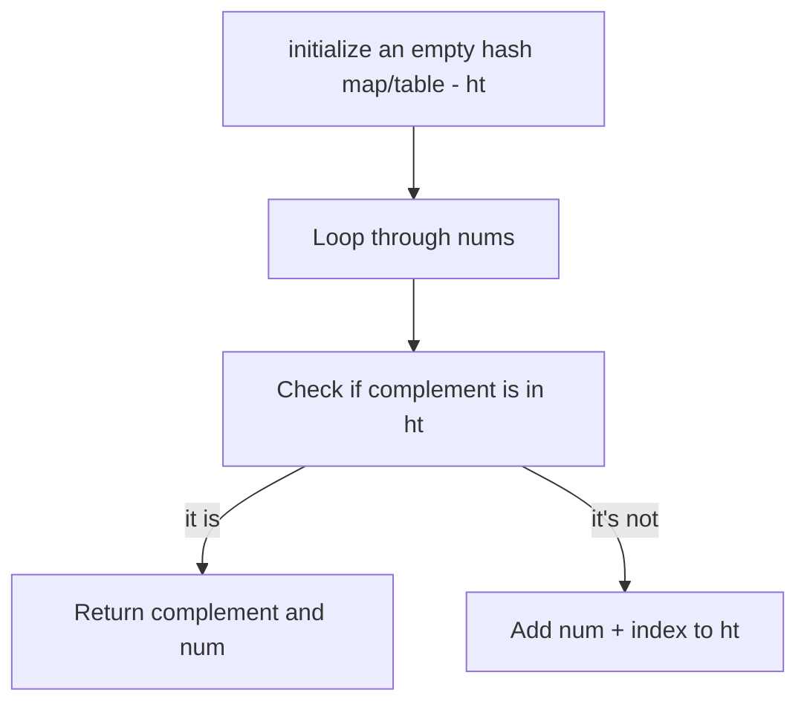

# Hash Maps

## Overview
Hash maps are an important data structure that can be used in a lot of LC-style problems. They're useful and efficient because they allow for O(1) lookups.

## Two Sum 
- [LC #1](https://leetcode.com/problems/two-sum/description/)
- Given an array of integers nums and an integer target, return indices of the two numbers such that they add up to target. You may assume that each input would have exactly one solution, and you may not use the same element twice. You can return the answer in any order.

### Solution Walkthrough
- The popular solution for this (the one used in solutions/leetcode_solutions.py) is based on the fact that *`complement = target - num`*
- First we initialize an empty hash map/table (`ht`). This is where we will store ints to their index in nums. Then we loop through nums.
#### Steps

