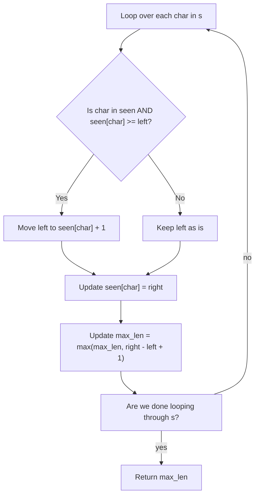

# Sliding Window

## Longest Substring Without Repeating Characters
- [LC #3](https://leetcode.com/problems/longest-substring-without-repeating-characters/description/)
- Given a string `s`, find the length of the longest substring without duplicate characters.

### Solution Walkthrough
- start by initializing `left` and `max_len` to 0, and `seen` as an empty dict
- `right` will be the current index while looping through `s`

